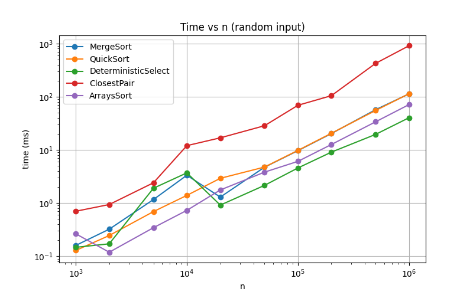
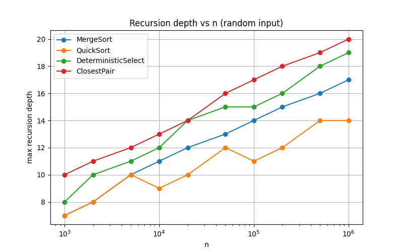
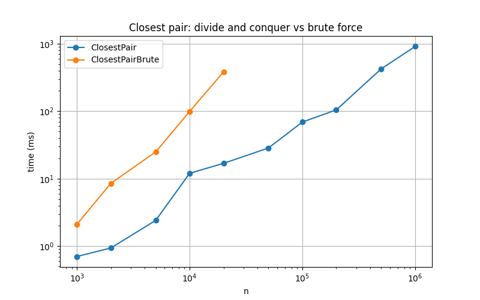
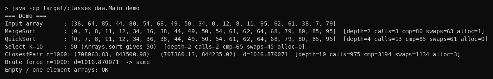
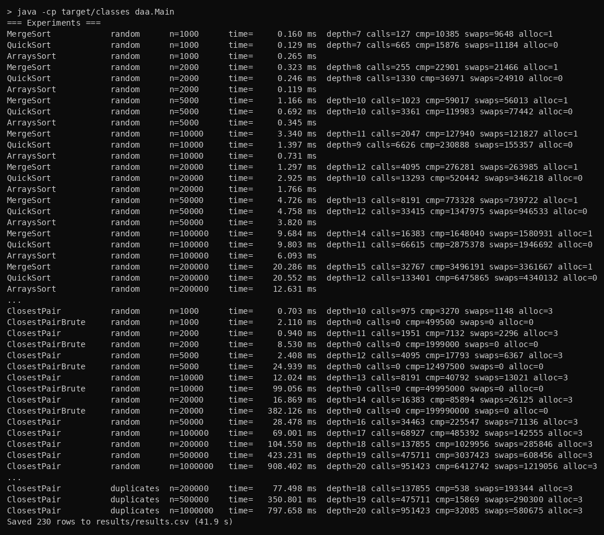
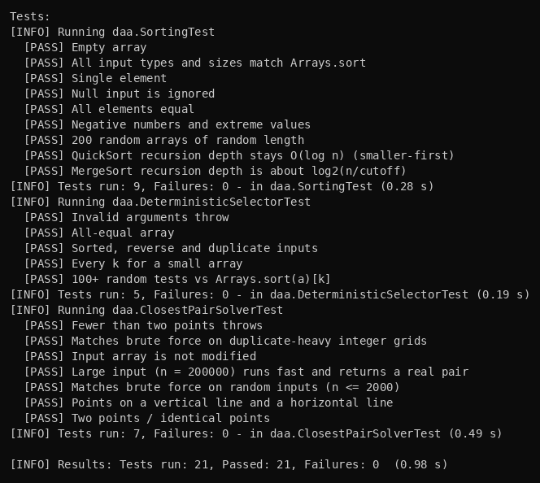
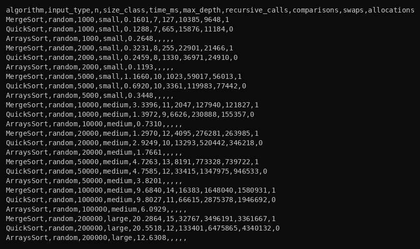

# Assignment 1 - Divide and Conquer

In this assignment I implemented 4 divide and conquer algorithms in Java, measured their time and recursion depth, and compared results with theory.

## How to run

Run tests:
```
mvn test
```

Run program (demo + experiments, saves results/results.csv):
```
mvn compile
java -cp target/classes daa.Main
```

You can also run only demo: `java -cp target/classes daa.Main demo`

Plots are made with python:
```
python3 docs/plots/plots.py
```

## A. Project Overview

The goal of the assignment is to implement divide and conquer algorithms, analyze them with Master Theorem, and check if the real running time is the same as the theory.

Implemented algorithms:
1. MergeSort
2. QuickSort (random pivot)
3. Deterministic Select (median of medians)
4. Closest Pair of Points

Classes:
- `MergeSorter.java`, `QuickSorter.java`, `DeterministicSelector.java`, `ClosestPairSolver.java` - algorithms
- `Point.java` - point with x and y
- `Metrics.java` - counts recursion depth, recursive calls, comparisons, swaps and allocations
- `Experiment.java` - runs all tests with different sizes and saves CSV
- `Main.java` - main class

## B. Algorithm Analysis

### MergeSort
Array is divided into two halves, each half is sorted recursively and then they are merged.
- I use one buffer array for all merges (it is created only once).
- If part is small (16 or less) I use insertion sort, because it is faster for small arrays.
- If `a[mid] <= a[mid+1]` the halves are already in order so merge is skipped.

Recurrence: T(n) = 2T(n/2) + O(n)

Master Theorem: a = 2, b = 2, f(n) = n. n^(log_b a) = n, so this is case 2 -> **T(n) = Θ(n log n)**

Space: O(n) for buffer + O(log n) for recursion.

### QuickSort
Random pivot is chosen, array is partitioned into 3 parts: less than pivot, equal to pivot, greater than pivot (3-way partition, this helps with duplicates). Partition is in-place.

Recursion is called only for the smaller part, and the bigger part is done in a while loop. Because of this the recursion depth is O(log n).

Recurrence:
- average: T(n) = 2T(n/2) + O(n) -> **O(n log n)**
- worst case (bad pivot every time): T(n) = T(n-1) + O(n) -> **O(n^2)**, but with random pivot it almost never happens

Space: O(log n) because of smaller-first recursion.

### Deterministic Select (Median of Medians)
Finds k-th smallest element.
1. Divide array into groups of 5 and sort each group.
2. Take the median of each group.
3. Find median of these medians with recursion - this is the pivot.
4. Partition array around pivot (in-place).
5. Go with recursion only to the part where k is.

The pivot is always good: at least about 3n/10 elements are smaller and 3n/10 are bigger. So the next part has maximum 7n/10 elements.

Recurrence: T(n) = T(n/5) + T(7n/10) + O(n)

Master Theorem can not be used here (two different subproblems), so I use Akra-Bazzi intuition: 1/5 + 7/10 = 9/10 < 1, so work on every level gets smaller: n + 0.9n + 0.81n + ... <= 10n. So **T(n) = Θ(n)**.

### Closest Pair of Points
1. Sort points by x.
2. Divide points into left and right half by middle x, solve both halves with recursion.
3. d = min(dLeft, dRight).
4. Take points which are closer than d to the middle line (strip). Points in strip are sorted by y (I merge halves by y like in merge sort, so no need to sort again).
5. For every point in strip check only next points while y difference < d (it is max 7 points).

Recurrence: T(n) = 2T(n/2) + O(n) -> Master Theorem case 2 -> **Θ(n log n)**

Brute force checks all pairs so it is O(n^2).

## C. Experimental Results

Sizes: 1000, 2000, 5000, 10000, 20000, 50000, 100000, 200000, 500000, 1000000 (small / medium / large).

Input types: random, sorted, reverse sorted, duplicates (only 10 different values). For points: random and duplicates.

For every test there are 2 warm-up runs (for JIT) and then 5 runs, and I take the median time. Time is measured with `System.nanoTime()`. Also I compared with `Arrays.sort` and brute force.

All results are in `results/results.csv`.

### Time (ms), random input

| Algorithm | n=1000 | n=10000 | n=100000 | n=1000000 |
|---|---|---|---|---|
| MergeSort | 0.16 | 3.34 | 9.68 | 113.07 |
| QuickSort | 0.13 | 1.40 | 9.80 | 113.77 |
| Arrays.sort | 0.26 | 0.73 | 6.09 | 71.12 |
| DeterministicSelect | 0.15 | 3.70 | 4.58 | 40.26 |
| Sort + a[k] | 0.04 | 0.58 | 6.99 | 79.88 |
| ClosestPair | 0.70 | 12.02 | 69.00 | 908.40 |
| ClosestPair brute force | 2.11 | 99.06 | - | - |

### Time (ms) for different input types, n = 1000000

| Algorithm | random | sorted | reverse | duplicates |
|---|---|---|---|---|
| MergeSort | 113.07 | 2.52 | 43.11 | 65.53 |
| QuickSort | 113.77 | 76.32 | 77.14 | 18.84 |
| Arrays.sort | 71.12 | 0.24 | 0.67 | 14.45 |
| DeterministicSelect | 40.26 | 19.19 | 21.43 | 25.73 |

### Max recursion depth, random input

| Algorithm | n=1000 | n=10000 | n=100000 | n=1000000 |
|---|---|---|---|---|
| MergeSort | 7 | 11 | 14 | 17 |
| QuickSort | 7 | 9 | 11 | 14 |
| DeterministicSelect | 8 | 12 | 15 | 19 |
| ClosestPair | 10 | 13 | 17 | 20 |

For n = 1000000 with duplicates the depth of QuickSort is only 4 and Select is 11.

### Comparisons (additional metric), random input

| Algorithm | n=1000 | n=10000 | n=100000 | n=1000000 |
|---|---|---|---|---|
| MergeSort | 10385 | 127940 | 1648040 | 20290890 |
| QuickSort | 15876 | 230888 | 2875378 | 35845170 |
| DeterministicSelect | 9002 | 97036 | 981106 | 10304461 |
| ClosestPair (strip checks) | 3270 | 40792 | 485392 | 6412742 |

### Plots

Time vs n:



Recursion depth vs n:



Closest pair vs brute force:



## D. Discussion

**Do the results match theoretical complexity?**
Mostly yes. For sorting when n becomes 10 times bigger the time becomes about 11-12 times bigger, this is n log n. MergeSort makes about n*log2(n) comparisons (20.3 million for n = 1000000, and n*log2(n) = 19.9 million). Select makes about 10n comparisons for every n, so it is linear. Brute force closest pair grows about 4 times when n is 2 times bigger (n^2), and divide and conquer grows much slower. For small n (1000-10000) the time is not stable, because the program runs very fast and JIT and other things have big effect.

**How does input structure affect performance?**
MergeSort is very fast on sorted array because merge is skipped. QuickSort with random pivot works fine on sorted and reverse arrays (no O(n^2)). With duplicates QuickSort is much faster (18.84 ms vs 113.77 ms) and depth is only 4, because 3-way partition removes all equal elements at once. Arrays.sort is almost instant on sorted and reverse arrays because Java checks for sorted runs.

**Why does smaller-first recursion help QuickSort?**
Recursion goes only into the smaller part, which is maximum half of the array. So every level the size is at least 2 times smaller and depth can not be more than log2(n). The bigger part is done in the loop, so it does not use stack. Without this, in the worst case depth can be n and we can get StackOverflowError. In my results depth was 14 for n = 1000000.

**Why does Median-of-Medians guarantee O(n)?**
Because the pivot is always not far from the middle, the next recursion gets maximum 7n/10 elements. Plus n/5 for finding pivot. 7/10 + 1/5 = 9/10 < 1, so the work decreases every level and the total is less than 10n. But the constant is big, so for small n it is slower than just sorting. For n = 1000000 it was 2 times faster than sort (40 ms vs 80 ms).

**Why is divide-and-conquer Closest Pair faster than O(n^2)?**
Brute force checks all n(n-1)/2 pairs. Divide and conquer checks only points in the strip and only up to 7 neighbours, so it is O(n log n). For n = 20000 brute force was 382 ms and D&C only 17 ms. For n = 1000000 brute force would take many minutes, D&C takes less than 1 second.

**What practical factors affect performance?**
- JIT: first runs are slower, so I used warm-up runs.
- Cache: arrays of int are fast, but Point objects are stored in different places in memory, so closest pair is slower.
- GC: I create buffer only once, so there are not many allocations.
- Arrays.sort is faster than my sorts because it is very optimized and does not count metrics.
- The computer and other programs running also change the time.

## E. Reflection

In this assignment I learned how to write recurrences for divide and conquer algorithms and how to check them with experiments. It was interesting that counting comparisons shows the theory much better than time, because time for small arrays jumps a lot. I also understood that O(n) algorithm is not always faster in practice, for example median of medians is slower than sorting for small arrays because of the big constant.

The hardest parts were median of medians (moving group medians to the front without breaking the array) and closest pair (keeping points sorted by y after recursion and building the strip). Also normal partition was very slow with many duplicates, so I changed it to 3-way partition. Tests with Arrays.sort and brute force helped me to find mistakes with indexes.

## F. Screenshots

Program output:





Test results:



Results CSV:

